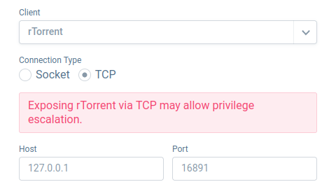

# Seedbox

Docker based seedbox and personnal media server compatible with raspery pi arm64 architecture

All what you need is a clean and fresh docker setup

---

### ✨ Main features

#### **Modern web UI to manage torrents**

Includes [flood modern UI](https://flood.js.org/)  for torrent management. Enjoy a smooth, awesome experience on any device.

#### **optimized torrent client**

It's important to be able to share files you download in order to have a good ratio on your favorite torrent tracker.

Choose between **rTorrent** and **qBittorrent** client

#### **Open vpn support**

A real self-hosted seedbox needs to guarantee anonymity. All services could use openvpn to hide you ip address

#### **Web browser file explorer**

Access download and share all your files over internet in a modern web browser UI based on [filebrowser](https://filebrowser.org/features)

#### **UpNp media server**

Stream your content on you local network directly with VLC media player or with any device compatible with up the UpNp protocol

#### **Samba file server**

Mount your seedbox download folder on any Windows or Linux computer

---

### 🛠️ Installation

1) Clone the project : `git clone https://github.com/Chris3481/seedbox.git`
 
2) Create your .env file : `cp .env.example .env`

3) If you want to enable VPN tunnel, copy your `.ovpn` file into `vpn` folder (you should create it on the root project directory)

4) Run `./seedbox.sh run`

Access flood interface on `http://<server-ip>:3000` 

Create a new admin user

---

### ⚙️ Configuration 

| Variable               | Description                                                 |      default |
|------------------------|:------------------------------------------------------------|-------------:|
| USER_ID                | Host user ID.  You can find if with the command `id -u`  |         1000 |
| GROUP_ID               | Host group ID.  You can find if with the command `id -g` |         1000 |
| TIMEZONE               | Your timezone.                                           | Europe/Paris |
| ENABLE_VPN             | Use openVpn tunnel.  requires installation step 3        |        false |
| TORRENT_CLIENT         | Choose torrent client rtorrent / qbitorrent                 |     rtorrent |
| FLOOD_PORT             | Port to access flood interface                              |         3000 |
| WEB_BROWSER_PORT       | Port to access web file browser                             |         8080 |
| RTORRENT_PEER_PORT     | Rtorrent port used for peer connexions                      |        50000 |
| RTORRENT_DHT_PORT      | Rtorrent port used for DHT                                  |         6882 |
| QBITTOTTENT_PEER_PORT  | Qbittorrent port used for peer connexions                   |         6881 |
| BASE_PATH              | Project base path                                           |              |
| DOWNLOAD_FOLDER_PATH   | Download folder path                                        |              |

